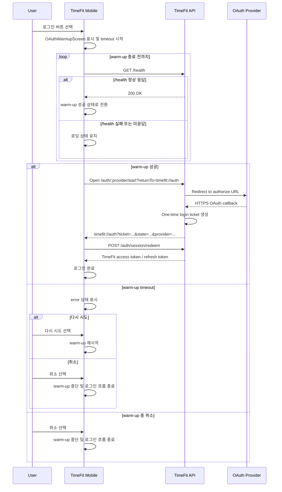

# OAuth 로그인 전 서버 Warm-up 구조 도입 배경

## 1. 문서 목적

이 문서는 TimeFit 모바일 OAuth 로그인 전에 API가 `/health` 요청에 정상 응답 가능한지 확인하는 구조를 왜 도입했는지 기록한다.

기록 대상은 다음 네 가지다.

- TimeFit 모바일 OAuth 로그인 전에 `GET /health`를 확인하는 이유
- Render Free 기반 TimeFit 개발 환경에서 관찰된 cold start UX 문제
- 외부 로딩 화면 대신 앱 내부 `OAuthWarmupScreen`을 먼저 표시하기로 한 결정
- 이 구조가 인증 아키텍처가 아니라 임시 인프라 대응 계층이며, 상시 실행 서버 전환 시 제거 또는 단순화할 수 있다는 점

구현값은 현재 코드 기준으로만 적는다. OAuth secret, token, one-time ticket 원문은 문서에 포함하지 않는다.

## 2. 배경

TimeFit의 현재 OAuth 인증 구조는 Backend OAuth Callback 방식이다. 모바일 앱이 Provider token을 직접 관리하지 않고, Backend가 Google/Kakao/Naver authorize URL 생성, callback 처리, token exchange, TimeFit 세션 발급을 담당한다.

현재 흐름은 다음과 같다.

```text
Mobile App
-> GET /auth/:provider/start?returnTo=timefit://auth
-> Google / Kakao / Naver
-> GET /auth/:provider/callback
-> One-time login ticket 생성
-> timefit://auth Deep Link
-> Mobile App
-> POST /auth/session/redeem
-> TimeFit Access Token / Refresh Token 발급
```

현재 구현 스냅샷:

- 서버 컨트롤러: `apps/api/src/modules/auth/auth.controller.ts`
- 서버 서비스: `apps/api/src/modules/auth/auth.service.ts`
- OAuth start endpoint: `GET /auth/:provider/start`
- OAuth callback endpoint: `GET /auth/:provider/callback`
- Ticket redeem endpoint: `POST /auth/session/redeem`
- Health endpoint: `GET /health`
- 지원 provider: `google`, `kakao`, `naver`
- 기본 앱 복귀 URL: `timefit://auth`
- Render 설정의 API base URL: `https://timefit-api.onrender.com`
- Render 설정의 health check path: `/health`

Backend OAuth Callback을 선택한 이유는 인증 정책을 Backend에 집중시키기 위해서다.

- Provider redirect URI는 HTTPS Backend Callback을 사용한다.
- 앱 deep link는 Provider callback이 아니라 Backend 처리 후 최종 앱 복귀 용도다.
- Google/Kakao/Naver의 authorize URL, token endpoint, token exchange 차이를 Backend에서 통합한다.
- Provider client secret과 Provider token exchange는 Backend에 둔다.
- 앱은 Provider token을 직접 다루지 않고 one-time login ticket만 받아 TimeFit 세션으로 교환한다.

## 3. 발생한 문제

### 문제 상황

기존에는 사용자가 Google/Kakao/Naver 로그인 버튼을 누르면 앱이 곧바로 외부 OAuth 세션을 열고 다음 URL을 요청했다.

```http
GET /auth/:provider/start?returnTo=timefit://auth
```

TimeFit 개발 환경의 Render Free 배포에서는 API 인스턴스가 비활성 상태일 때 이 첫 요청이 즉시 Provider authorize URL로 redirect되지 못하는 상황이 관찰됐다.

그 결과 사용자는 Provider 로그인 화면 전에 Render의 Application Loading 화면을 볼 수 있었다. 이 화면은 TimeFit이 제어하는 UI가 아니므로 로그인 버튼이 고장 난 것처럼 보이거나, 서버 준비 지연을 OAuth 실패로 오해할 수 있다.

이 문제는 APK, Dev Build, Play Store 배포 여부와 독립적이다. 앱 패키징 방식이 달라져도 OAuth 시작 URL이 동일한 sleeping backend를 직접 열면 첫 요청이 Backend 준비 시간에 걸릴 수 있다.

주의할 점은, 이 문서가 Render Free의 동작을 일반적인 보장이나 제약으로 설명하지 않는다는 것이다. 여기서는 TimeFit의 현재 개발/배포 환경에서 관찰한 OAuth 시작 UX 문제와 그 대응 구조만 기록한다.

## 4. 왜 앱 내부에서 해결하기로 했는가

Render loading page는 TimeFit 앱이 제어할 수 없다. OAuth 브라우저 세션을 이미 열어버리면 앱은 그 화면의 문구, 진행률, 취소 UX를 제공할 수 없다.

기존 흐름:

```text
사용자 로그인 버튼 클릭
-> 즉시 외부 OAuth 세션 실행
-> Backend가 sleep 상태
-> Render loading page
-> Backend 응답 가능 상태로 전환
-> Provider login page
```

변경 흐름:

```text
사용자 로그인 버튼 클릭
-> TimeFit 내부 Warm-up UI 표시
-> GET /health polling
-> API가 HTTP 요청에 응답 가능한 상태인지 확인
-> OAuth session 실행
-> Provider login page
```

아키텍처 결정:

- OAuth 브라우저는 API가 `/health` 요청에 정상 응답 가능한 상태로 확인된 뒤에만 연다.
- 대기 시간은 외부 인프라 페이지가 아니라 TimeFit UI 안에서 처리한다.
- OAuth start/callback/redeem 인증 흐름은 변경하지 않는다.
- cold start 대응 로직을 인증 로직 앞단의 UX 계층으로 둔다.

현재 구현 스냅샷:

- 모바일 인증 컨텍스트: `apps/mobile/src/features/auth/context.tsx`
- Warm-up UI: `apps/mobile/src/features/auth/components/OAuthWarmupScreen.tsx`
- 로그인 화면 연결: `apps/mobile/src/features/auth/screen/LoginScreen.tsx`
- Health 요청 함수: `apps/mobile/src/services/api/client.ts`의 `checkOAuthServerHealth`
- `login`은 warm-up 성공 후 `buildOAuthStartUrl(provider, redirectUri)`로 start URL을 만들고 `WebBrowser.openAuthSessionAsync(authUrl, redirectUri)`를 호출한다.

## 5. 최종 사용자 흐름



여기서 warm-up 성공은 API가 `/health` 요청에 정상 응답했다는 의미다. Provider 상태, OAuth callback 처리, token exchange, one-time login ticket 발급 등 이후 OAuth 단계의 성공까지 보장한다는 의미는 아니다.

현재 warm-up 구현값:

- 상태 타입: `OAuthWarmupStatus = 'checking' | 'ready' | 'error'`
- 전체 timeout: `OAUTH_WARMUP_TIMEOUT_MS = 60_000`
- 시도 간격 기준값: `OAUTH_WARMUP_INTERVAL_MS = 2_000`
- health 요청별 timeout: `OAUTH_HEALTH_REQUEST_TIMEOUT_MS = 4_000`
- 준비 판정: `GET /health` 응답의 `response.ok`
- interval 처리: 각 시도 소요 시간을 뺀 만큼 대기해 약 2초 단위로 다음 시도를 시작한다.
- 실패 처리: timeout 시 `error` 상태를 유지하고 다시 시도/취소 액션을 제공한다.
- 취소 처리: warm-up용 `AbortController`를 abort하고 로그인 loading 상태를 해제한다.

## 6. 선택하지 않은 방법

### OAuth 시작 URL을 그대로 열고 기다리기

구현은 가장 단순하지만 사용자가 Render loading page를 그대로 보게 된다. 문제는 Provider 인증 실패가 아니라 첫 Backend 요청의 준비 지연이므로, 외부 로딩 화면에 노출하는 방식은 UX 오해를 줄이지 못한다.

### OAuth callback 또는 token exchange 구조 변경

문제 지점은 `/auth/:provider/start` 첫 요청이 Provider redirect까지 도달하기 전의 대기 시간이다. Provider callback, Backend token exchange, one-time ticket redeem 구조는 문제의 원인이 아니므로 변경하지 않는다.

### 앱에서 Provider OAuth를 직접 처리

Provider token 처리를 앱으로 옮기면 Provider별 정책 차이와 secret 관리 책임이 모바일로 분산된다. TimeFit은 Backend Callback 구조로 인증 책임을 서버에 유지한다.

### 로그인과 무관한 keep-alive로 서버 깨우기

로그인과 무관하게 서버를 주기적으로 깨우는 방식도 선택하지 않았다. 이는 로그인 시점의 UX를 제어하는 이번 변경보다 더 넓은 운영 대응에 가깝다. 특히 모바일 앱의 백그라운드 실행에 의존하는 keep-alive는 OS 제약으로 안정성을 보장하기 어렵다. 현재 문제는 로그인 버튼 직후의 UX이므로 사용자 액션에 연결된 foreground warm-up으로 처리한다.

## 7. 제거 또는 단순화 기준

이 구조는 영구 인증 구조가 아니라 현재 인프라 조건에 대한 UX 완충 계층이다. 다음 조건이 충족되면 제거하거나 단순화할 수 있다.

- API 서버가 상시 실행 환경으로 전환되어 `/auth/:provider/start`가 cold start 없이 안정적으로 응답한다.
- `GET /health` 선확인 없이 `WebBrowser.openAuthSessionAsync`를 바로 호출해도 Provider 로그인 화면이 먼저 노출되는 것이 검증된다.
- OAuth 시작 실패를 별도 warm-up UI로 완충할 필요가 없을 만큼 서버 가용성이 확보된다.

제거 시 정리 순서:

1. `apps/mobile/src/features/auth/context.tsx`에서 `waitForOAuthServerReady`, warm-up 상수, `OAuthWarmupState` 사용 범위를 제거하거나 단순화한다.
2. `login` 흐름에서 `checkOAuthServerHealth` 선행 호출을 제거하고 `buildOAuthStartUrl` 이후 바로 `WebBrowser.openAuthSessionAsync`를 호출한다.
3. `apps/mobile/src/features/auth/screen/LoginScreen.tsx`에서 `OAuthWarmupScreen` 렌더링과 관련 disabled 조건을 제거한다.
4. `apps/mobile/src/features/auth/components/OAuthWarmupScreen.tsx`가 더 이상 참조되지 않으면 삭제한다.
5. `apps/mobile/src/services/api/client.ts`의 `checkOAuthServerHealth`가 다른 곳에서 쓰이지 않으면 제거한다.
6. `/health`는 Render health check와 운영 확인에도 쓰이므로 warm-up 제거와 별개로 유지 여부를 판단한다.

OAuth warm-up 제거는 Provider console redirect URI, Backend callback, one-time login ticket, `/auth/session/redeem` 흐름을 변경하지 않는 범위에서 진행한다.
